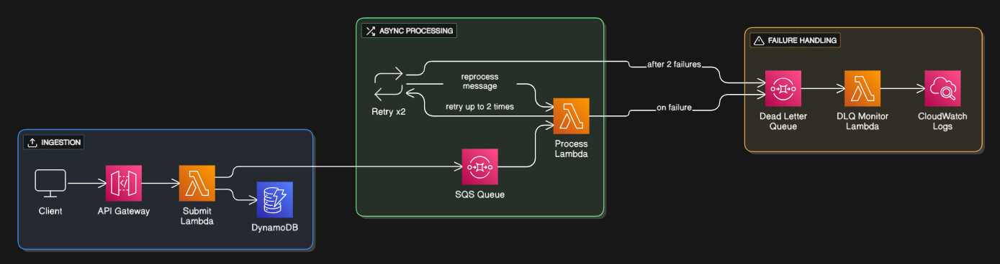

# Fault-Tolerant Task Processing System

[](https://www.typescriptlang.org/)
[](https://aws.amazon.com/lambda/)
[](https://www.serverless.com/)
[](https://github.com/airbnb/javascript)

## 📚 Documentation Overview

This repository contains a comprehensive fault-tolerant task processing system built on AWS serverless architecture.

## 🗂️ Documentation Structure

### Core Documentation
- **[Development Guide](docs/DEVELOPMENT.md)** - Development setup and workflow
- **[Architecture Guide](docs/ARCHITECTURE.md)** - System architecture and design patterns
- **[API Reference](docs/API_REFERENCE.md)** - API documentation with examples
- **[Deployment Guide](docs/DEPLOYMENT.md)** - Deployment instructions and configuration
- **[Testing Guide](docs/TESTING.md)** - Testing strategies and validation
- **[CI/CD Pipeline](docs/CI_CD.md)** - Continuous integration and deployment workflows

### Implementation Details
- **[Retry Strategy](docs/RETRY_STRATEGY_IMPLEMENTATION.md)** - Retry mechanisms and configuration

### Reference
- **[Configuration](docs/CONFIGURATION.md)** - Environment variables and settings

## 🚀 Quick Start

### Development Setup
```bash
# Install dependencies
npm install

# Run code quality checks
npm run code:check

# Fix code issues automatically
npm run code:fix

# Validate entire project
npm run validate

# Start local development
npm run local
```

### Documentation Flow
1. Read the [Architecture Guide](docs/ARCHITECTURE.md) to understand the system
2. Set up [CI/CD Pipeline](docs/CI_CD.md) for automated deployments
3. Follow the [Deployment Guide](docs/DEPLOYMENT.md) to set up your environment
4. Start with the [API Reference](docs/API_REFERENCE.md) for endpoints
5. Use the [Testing Guide](docs/TESTING.md) to validate your deployment

## 🏗️ System Overview

The fault-tolerant task processing system is a serverless, event-driven architecture built on AWS that provides:

- **Resilient Task Processing** with exponential backoff retry strategies
- **Comprehensive Monitoring** with CloudWatch integration and DLQ analytics
- **High Availability** through serverless architecture and auto-scaling
- **Security** with IAM best practices and data encryption
- **Observability** with structured logging, metrics, and distributed tracing

### Key Components
- **API Gateway** - REST API for task submission
- **Lambda Functions** - Serverless compute for task processing
- **SQS Queues** - Reliable message queuing with dead letter queue support
- **DynamoDB** - NoSQL database for task state management
- **CloudWatch** - Monitoring, logging, and alerting

## 📊 Architecture Diagram



## 🔧 Technology Stack

- **Runtime**: Node.js 20.x with TypeScript (ESM modules)
- **Framework**: Serverless Framework v3
- **AWS Services**: Lambda, API Gateway, SQS, DynamoDB, CloudWatch, X-Ray
- **Core Libraries**:
  - **AWS Powertools**: Logger, Metrics, Tracer for observability
  - **Middy.js**: Middleware engine with CORS, error handling, JSON parsing
  - **AWS SDK v3**: Modern AWS service clients
  - **Zod**: Schema validation and type safety for DTOs
- **Development**: ESLint, Prettier, TypeScript, Nodemon

## 📈 Key Features

### Fault Tolerance
- ✅ Exponential backoff retry with jitter
- ✅ Smart error classification and handling
- ✅ Dead letter queue monitoring and analytics
- ✅ Circuit breaker patterns for cascade failure prevention

### Observability
- ✅ Structured logging with correlation IDs
- ✅ Custom CloudWatch metrics and alarms
- ✅ X-Ray distributed tracing
- ✅ Sensitive data redaction in logs

### Performance
- ✅ Serverless auto-scaling architecture
- ✅ Optimized Lambda cold start performance
- ✅ Concurrent task processing with batch handling
- ✅ Resource-efficient retry mechanisms

### Security
- ✅ IAM least privilege access patterns
- ✅ Data encryption at rest and in transit
- ✅ Comprehensive input validation and sanitization
- ✅ Complete audit trail and operational logging
